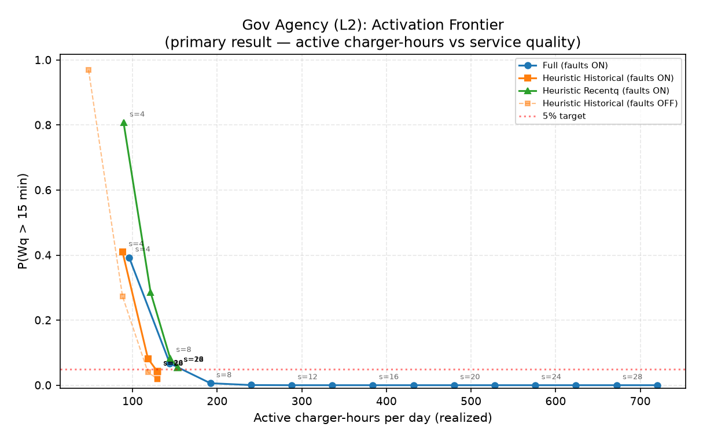

# EV Charging Queueing, Simulation, and Operations

An end-to-end study of how charging demand, service-time variability, equipment faults, and activation policies shape waiting times at public EV charging stations.

The project combines queueing theory, machine-learning forecasts, discrete-event simulation, and optimization on 441,077 charging sessions from 13 stations in Jiaxing, China. Its central question is practical: **how many chargers should be available, and when should they be active, to maintain service quality without over-provisioning?**

## What this project covers

- Tests whether station arrivals are plausibly Poisson and estimates time-varying arrival rates.
- Fits service-time distributions by charger type and compares analytical fleet-sizing approximations.
- Benchmarks XGBoost and LSTM demand forecasts on a chronological holdout period.
- Models charger faults as repair downtime with customer retries.
- Estimates session flexibility and compares FCFS, cost-first LP, and greedy scheduling.
- Evaluates full-capacity and demand-responsive activation policies with SimPy.
- Exposes the precomputed simulation frontier through a React simulator.

## Main findings

| Finding | Result | Interpretation |
|---|---:|---|
| Dataset scale | 441,077 sessions, 13 stations | Large enough to expose station-level and temporal heterogeneity |
| Arrival process | Poisson rejected at all 13 stations | Hourly NHPP rates are useful, but residual overdispersion remains |
| XGBoost forecast | MAE 1.518, RMSE 2.256, R^2 0.508 | 21.2% lower MAE than last-week-same-hour |
| LSTM forecast | Horizon-1 MAE 1.533 | About 1.0% worse than XGBoost; added complexity did not pay off |
| Weather ablation | -0.35% MAE change | Weather contributed little beyond temporal demand features |
| Flexibility proxy | 11.5% likely; 25.5% likely or possible | A meaningful but limited scheduling opportunity |
| Cost-first LP | +19.47 min mean wait vs. FCFS | Lower charging cost did not imply acceptable service quality |
| Fault tax | +2 chargers only at Gov Agency | Fault exposure was operationally material at one representative station |
| Historical activation | 21.8-32.7% fewer active charger-hours | Service target met at three of four stations with the base heuristic |
| Simulator validation | 10/10 exact-fleet checks passed | Lookup results agreed with independent-seed SimPy runs |



The red line marks the target `P(wait > 15 min) = 5%`. The activation policy reduces active charger-hours substantially, while the full simulation remains the binding service-quality check.

## Study design

```text
Raw sessions
    -> quality checks and station-hour aggregation
    -> arrival and service-time models
    -> analytical fleet-sizing screens
    -> XGBoost and LSTM forecasting
    -> SimPy fault and capacity simulation
    -> flexibility and scheduling policies
    -> activation frontiers and independent validation
    -> React lookup simulator
```

Analytical M/M/s and M/G/s calculations are treated as screening tools. Reported service levels come from full-day simulations with a seven-day warm-up, independent random-number streams, customer-level retry identity, and 50 replications per configuration.

## Explore the repository

| Path | Contents |
|---|---|
| [`Code/`](Code/) | Weekly analysis, forecasting, simulation, optimization, and export scripts |
| [`Results/`](Results/) | Aggregate tables, validation outputs, and publication-ready figures |
| [`tests/`](tests/) | Simulation and scheduling regression tests |
| [`my-appcd/`](my-appcd/) | React/Vite simulator using exact precomputed fleet sizes |
| [`DATA_ACCESS.md`](DATA_ACCESS.md) | Dataset sources and reproduction requirements |

## Run the simulator

```powershell
cd my-appcd
npm ci
npm run dev
```

Open the local Vite URL shown in the terminal. The interface lets you compare stations, fleet sizes, fault settings, and activation modes. Unsupported fleet sizes are not interpolated.

## Reproduce the analysis

### 1. Install Python dependencies

Python 3.11 or 3.12 is recommended.

```powershell
python -m venv .venv
.\.venv\Scripts\Activate.ps1
python -m pip install -r requirements.txt
```

Week 5 uses CUDA by default for LSTM training. Pass `--device auto` or `--device cpu` when a CUDA-capable GPU is unavailable.

### 2. Obtain the data

The primary dataset is available from [Figshare](https://doi.org/10.6084/m9.figshare.28182251.v3). ACN-Data is available through the [Caltech portal](https://ev.caltech.edu/dataset.html). Place authorized downloads in `Data/` as described in [`DATA_ACCESS.md`](DATA_ACCESS.md).

### 3. Run the pipeline

Scripts are ordered by study week and use canonical `Data/` and `Results/weekN_results/` paths.

```powershell
python Code/ingest_jiaxing.py
python Code/week1_wrapup.py
python Code/week2_eda.py
python Code/week3_analysis.py
python Code/week4_analysis.py
python Code/week5_analysis.py --device auto
python Code/week6_analysis.py
python Code/week7_analysis.py
python Code/week8_analysis.py
python Code/week9_analysis.py
python Code/week10_validation.py
python Code/export_simulator_data.py
```

The complete pipeline is computationally expensive; aggregate outputs are included so the findings can be inspected without rerunning every simulation.

### 4. Run regression tests

```powershell
python -m pytest
```

The tests cover fleet-independent exogenous arrivals, customer identity across fault retries, and arrival constraints in the Week 8 scheduler.

## Data scope

This repository publishes aggregate research outputs rather than raw or session-level records. Refer to [`DATA_ACCESS.md`](DATA_ACCESS.md) and [`NOTICE.md`](NOTICE.md) for dataset attribution and usage terms.

## License

Original software is available under the [MIT License](LICENSE). Source-dataset rights remain with their respective providers.
