# Week 2 EDA Report — Jiaxing EV Charging Dataset
*Generated by week2_eda.py — 2026-07-11 12:26*
---
## Plot 1: Daily Arrival Trend
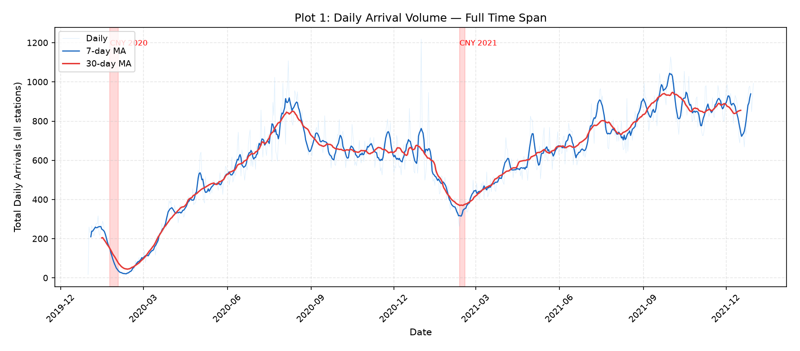
Total daily arrivals across all 13 stations. First-half 2020 mean: 317/day; second-half 2021 mean: 847/day. CNY periods (red bands) show sharp dips. Check for secular growth trend, COVID lockdown effects, and seasonal cycles. The 30-day MA reveals whether demand is stationary (needed for Poisson testing) or has a trend (which would require detrending for Week 3). Any visible step changes or regime shifts must be noted for simulation.
---
## Plot 2: Weekday vs Weekend
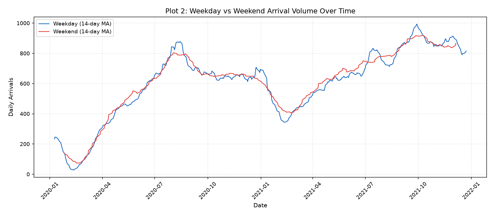
Weekday mean: 600/day; Weekend mean: 609/day (ratio: 0.99x). If the gap is stable over time, day_of_week is a strong covariate for ML. If the gap narrows or reverses seasonally, interaction terms may be needed. Large weekday/weekend differences also affect the hourly NHPP rate function — separate rate functions for weekday/weekend may be necessary.
---
## Plot 3: Day-of-Week Distribution
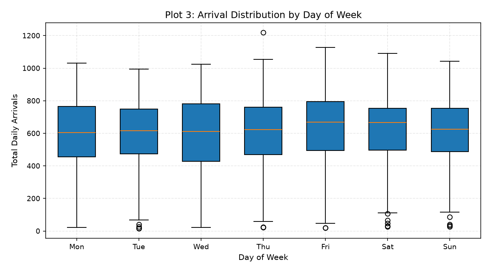
Peak day: Fri (624 avg); Trough day: Tue (585 avg). The shape of the violin (symmetric vs skewed) indicates whether day-of-week means are reliable or have high variance. This directly feeds the NHPP specification — if all weekdays are similar, a binary weekday/weekend indicator suffices; if Monday and Friday differ, per-day rate functions may be needed.
---
## Plot 4: Per-Station Trends
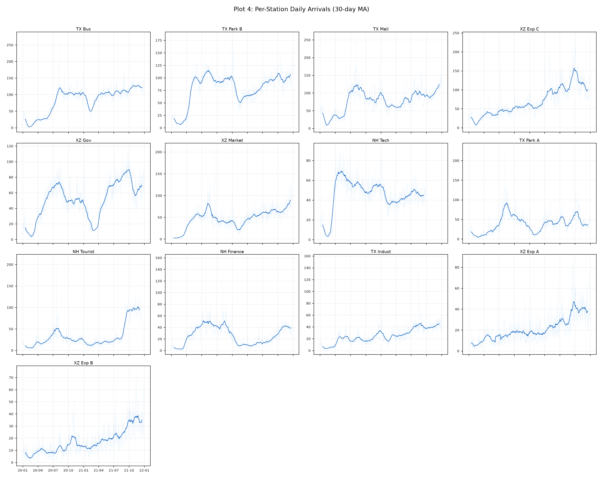
Individual station trends reveal whether the overall pattern (Plot 1) is driven by all stations uniformly or by a few dominant ones. Stations with different trend shapes (e.g., one growing while others plateau) indicate that pooled trend removal would be inappropriate. Expressway stations may show different seasonality (holiday travel) vs urban stations. Any station with a step change (new charger installation, closure) must be flagged.
---
## Plot 5: Hourly Profile + TOU
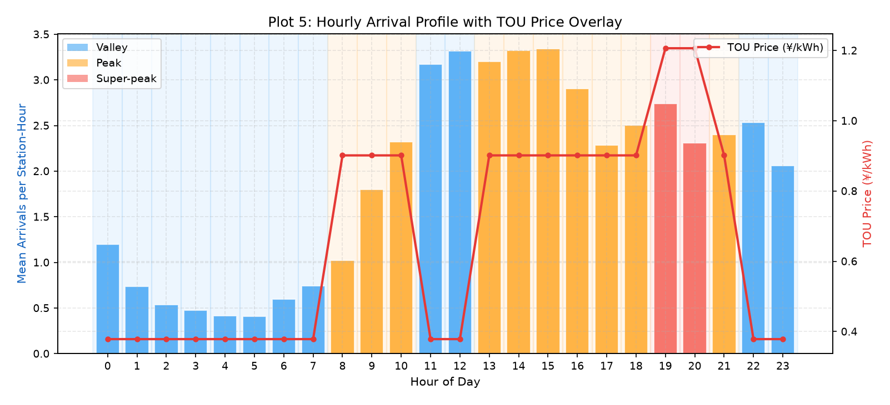
Peak arrival hour: 15:00; Trough: 5:00. Correlation between hourly arrivals and TOU price: r=0.533. Bar colors show TOU tier. If arrivals peak during Peak/Super-peak hours, users are NOT price-responsive — they charge when they need to. This is critical for scheduling: low price-responsiveness means the scheduler must actively shift sessions, not rely on organic behavior. The shape of this profile becomes the NHPP rate function λ(t).
---
## Plot 6: Station-Type Hourly Profiles
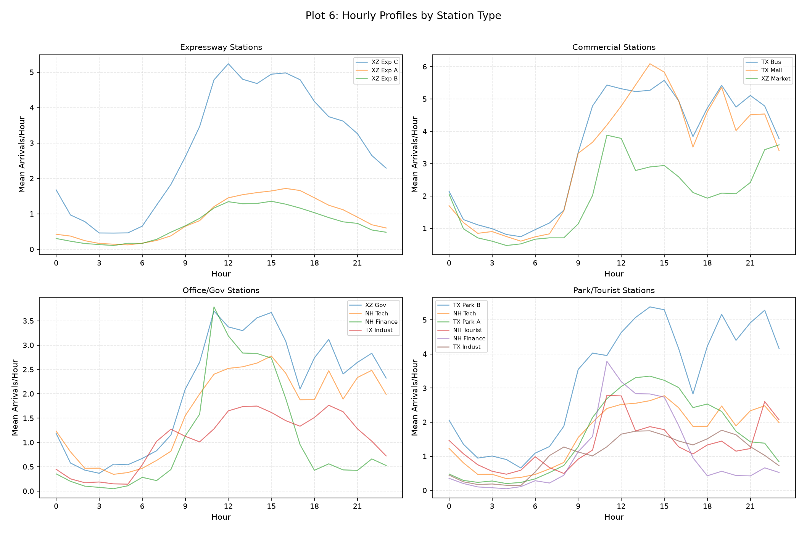
Expressway stations may show flatter profiles (transient users, less time-of-day structure). Commercial stations likely peak during business/shopping hours. Office stations should peak during commute hours. If station types have fundamentally different hourly shapes, a single NHPP rate function is inappropriate — per-station or per-type rate functions are needed. This also informs whether station pooling is valid for M/M/s analysis.
---
## Plot 7: TOU Tier Analysis
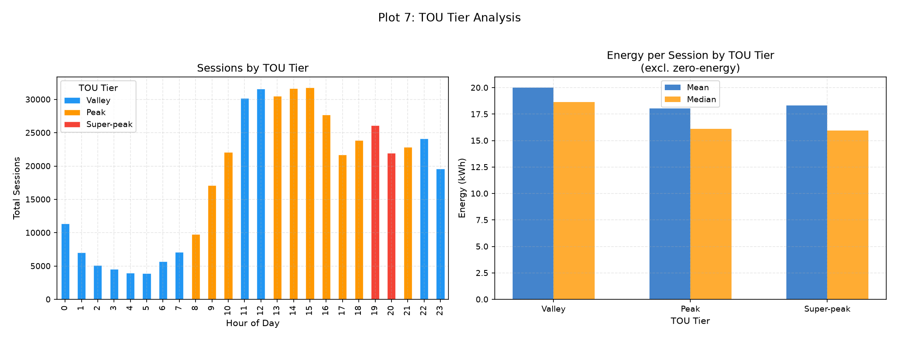
Left panel shows absolute session counts — since TOU tiers are time-deterministic, this is equivalent to 'which hours have most traffic.' Right panel shows whether users charge *more energy* during cheaper periods. If Valley sessions have higher mean energy, users may be deliberately doing full charges during off-peak. If energy is similar across tiers, there is no energy-shifting behavior. This directly bounds the scheduling optimizer's potential savings.
---
## Plot 8: Hour × Day Heatmaps
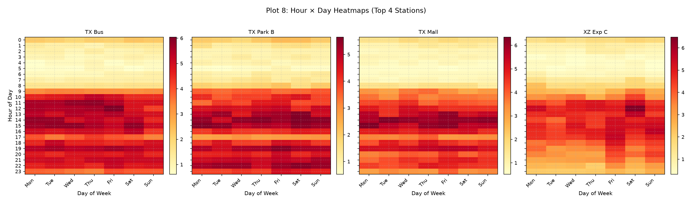
Each cell shows mean arrivals for that (hour, day) combination at a station. Diagonal patterns indicate that peak hours shift across days. Strong weekday/weekend contrast means is_weekend is a useful ML feature. If certain (hour, day) cells are consistently empty, the Poisson test for those intervals will have near-zero counts — these should be handled carefully. The hotspot pattern directly shapes the NHPP rate function granularity.
---
## Plot 9: Service Time Distributions
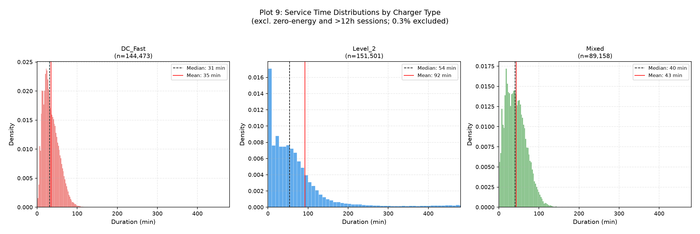
Service time distributions (excluding zero-energy, excluding >12h; 0.3% of non-zero sessions excluded). DC_Fast: mean=35min, median=31min, CV=0.57, skew=0.82; Level_2: mean=92min, median=54min, CV=1.39, skew=2.69; Mixed: mean=43min, median=40min, CV=0.60, skew=0.69. Right-skewed distributions with CV>1 indicate that M/M/s (which assumes exponential service times with CV=1) will underestimate congestion. M/G/s with fitted distributions (lognormal or Weibull) will be more accurate. The mean/median gap indicates the impact of long-tail sessions.
---
## Plot 10: Energy Distributions
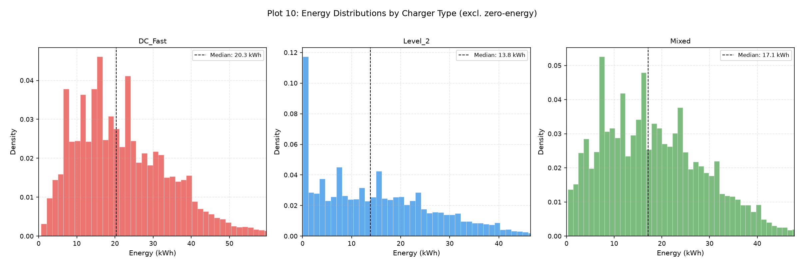
Energy per session informs the scheduling optimizer's load-shifting potential. If DC Fast sessions cluster tightly (low variance), their service demand is predictable. If L2 sessions have heavy tails, some sessions occupy chargers for long periods. The energy distribution also determines whether a fixed kWh capacity or variable duration-based model is more appropriate for simulation.
---
## Plot 11: Energy vs Duration
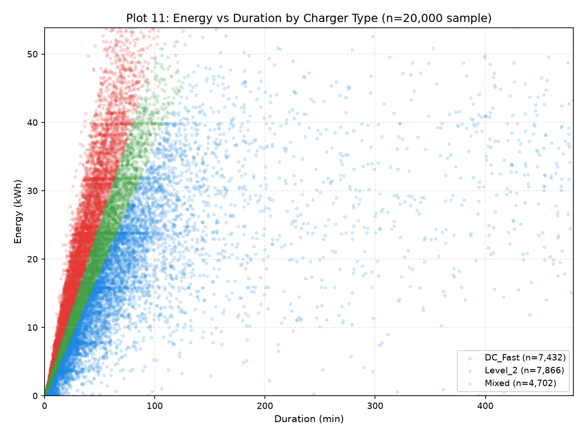
If the scatter shows tight linear bands, effective charging rate is consistent within each charger type. Spread indicates variable rates (partial charging, battery SoC effects, power degradation). Points along the x-axis (high duration, low energy) represent sessions where the car is parked but not charging — these inflate service time relative to actual demand. For M/G/s modeling, we need the *occupancy* duration, not just the charging duration.
---
## Plot 12: Zero-Energy Sessions
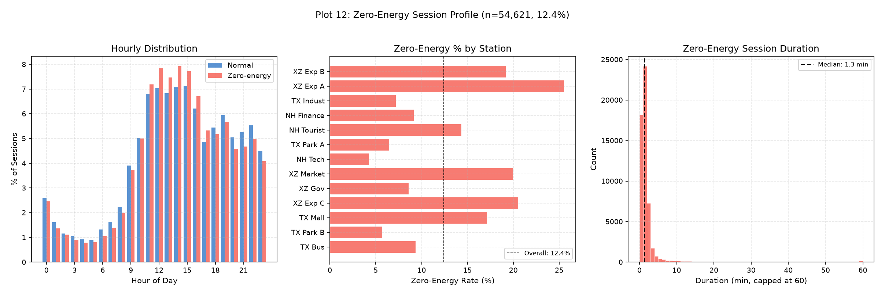
N=54,621 sessions (12.4%) delivered zero energy. Left: hourly distribution — if these mirror normal sessions, they are random connector failures. If they cluster at specific hours, there may be a systematic cause. Center: station-level rates — high concentration at specific stations suggests equipment issues. Right: duration distribution — very short durations (<1 min) = tap-and-leave; longer durations = connector failure with car parked. These sessions count as arrivals (occupy queue slot) but not service demand (no energy). For simulation, they should have near-zero service time but still occupy a charger.
---
## Plot 13: Fault Rate by Station
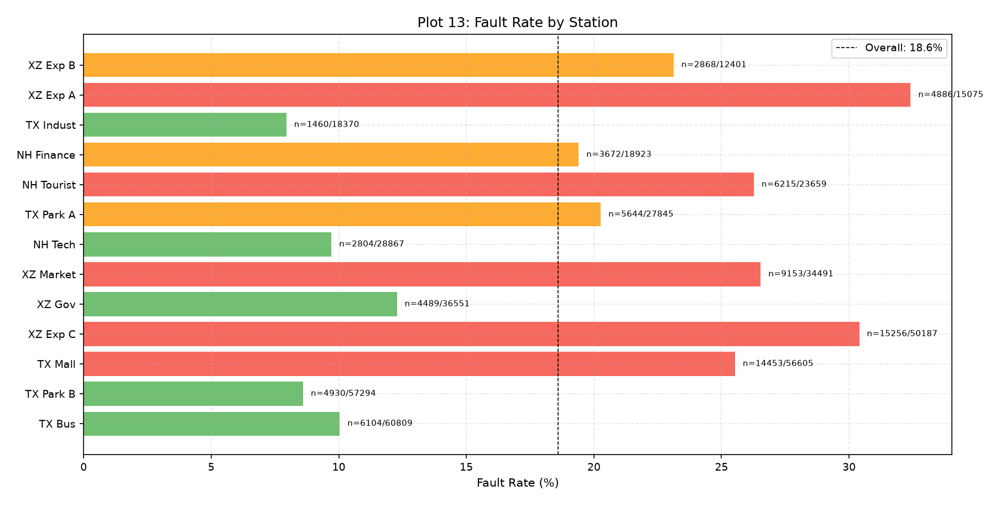
Highest: XZ Exp A (32.4%); Lowest: TX Indust (7.9%). Stations with >25% fault rates may need station-specific fault models in simulation. If fault rates correlate with charger type (DC Fast stations having higher faults), this should be reflected in the fault injection model. Wide variation (>3x) across stations means a uniform 18.6% rate is inappropriate for per-station simulation.
---
## Plot 14: Fault Temporal/Equipment Patterns
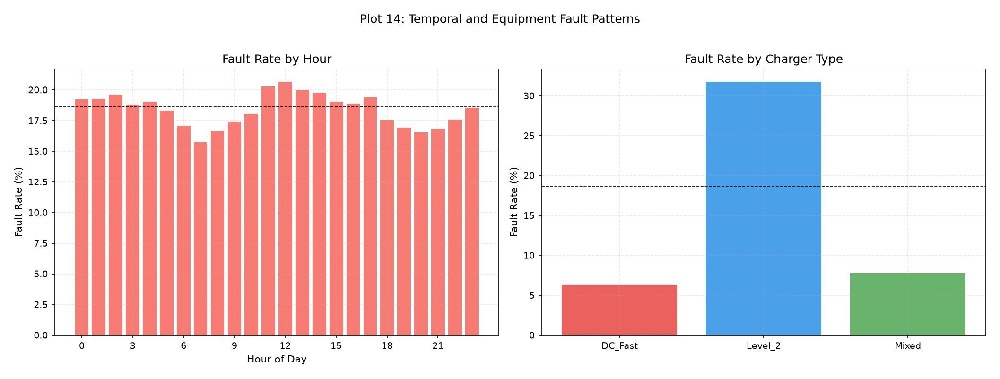
Left: If fault rate is flat across hours, faults are independent of demand level (equipment-driven, not congestion-driven). If faults spike during high-demand hours, capacity stress may cause faults — this has simulation implications. Right: If DC Fast has higher fault rates, the fault injection model should condition on charger type. Uniform fault rate by charger type simplifies the simulation model.
---
## Plot 15: Flexibility × TOU
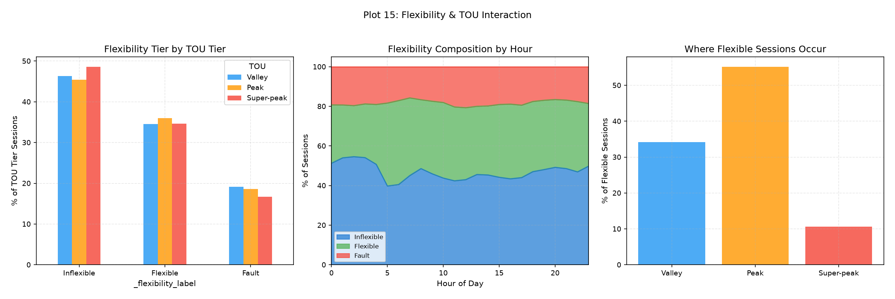
Flexible sessions during Peak+Super-peak: 65.8%. These are the sessions the scheduler could potentially shift to Valley. Left panel: If Flexible fraction is higher during Peak/Super-peak, users who can be interrupted tend to charge during expensive hours — this is exactly the target population for scheduling. Center panel: Hourly flexibility composition reveals when shifting potential exists. Right panel: Quantifies the upper bound on sessions available for TOU optimization.
---
## Plot 16: Fault / Zero-Energy Overlap
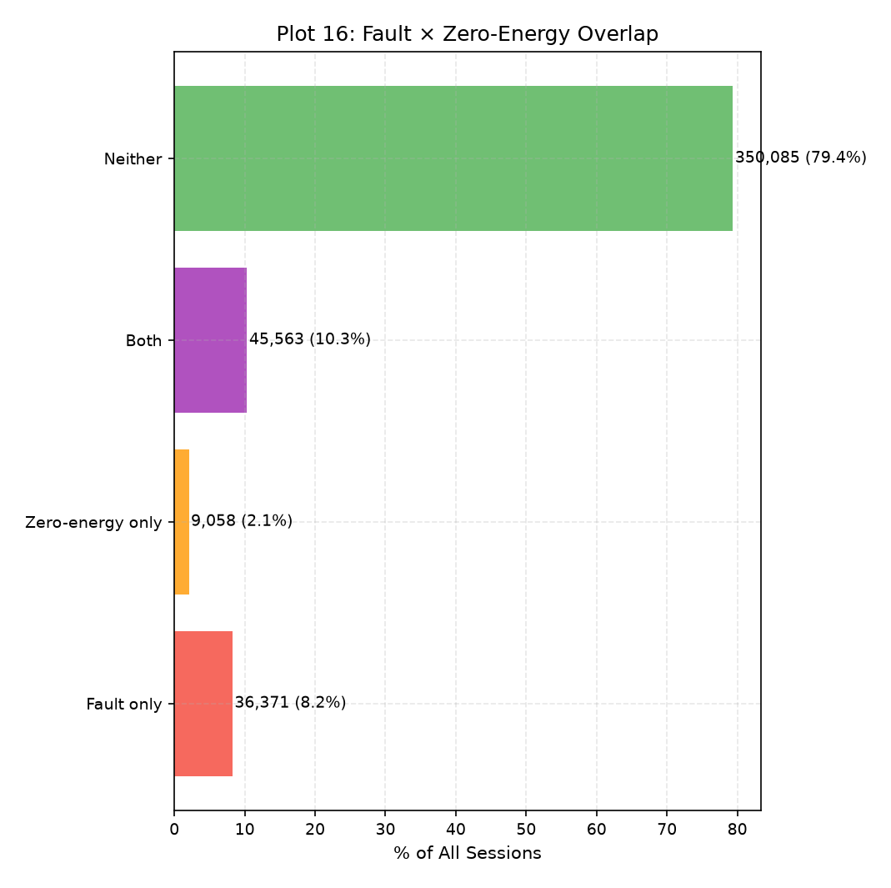
Fault-only: 36,371 (8.2%); Zero-energy-only: 9,058 (2.1%); Both: 45,563 (10.3%); Neither: 350,085 (79.4%). High overlap means faults largely explain zero-energy sessions. Low overlap means zero-energy has a different mechanism (user behavior, not equipment). For simulation: if most zero-energy sessions are also faults, a single fault model covers both; otherwise, separate zero-energy injection is needed.
---
## Plot 17: Weather Effects
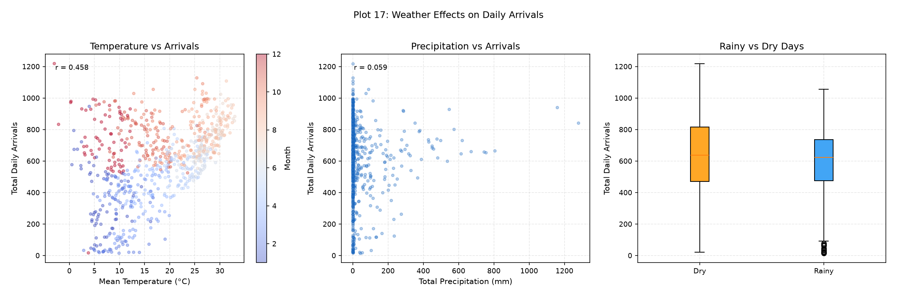
Temperature-arrivals correlation: r=0.458; Precipitation-arrivals correlation: r=0.059. CAUTION: The temperature correlation may reflect seasonality (month coloring in left panel). If warm months happen to have more arrivals due to secular growth, this is a confound, not a weather effect. The rainy/dry comparison (right) is less confounded since rain varies day-to-day. If the rainy-day effect is <5%, weather is not worth adding to the ML model as a primary feature.
---
## Plot 18: Detrended Weather
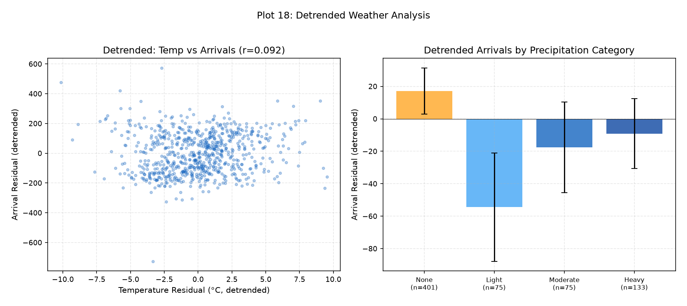
After removing monthly means (controlling for seasonality): Temperature-arrivals correlation drops to r=0.092. If the detrended correlation is near zero, the raw correlation was purely seasonal confound. Right panel: Precipitation categories after detrending — if heavy rain days show statistically significant negative residuals, rain is a real (if modest) effect. This determines whether precipitation should be an ML feature (Week 5) or can be omitted.
---
## Plot 19: Station Heterogeneity
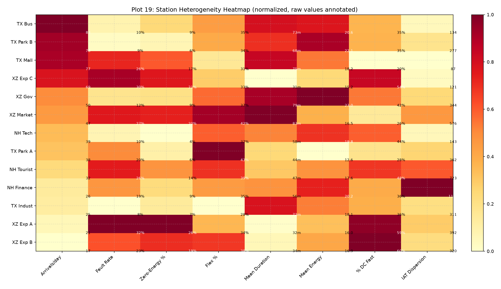
This heatmap reveals the structural diversity across stations. Key patterns to check: (1) Do high-traffic stations have lower fault rates (better maintained)? (2) Do expressway stations cluster together (high DC Fast %, high fault rate, short duration)? (3) Is IAT dispersion uniformly high, or do some stations approach Poisson-like behavior? Stations with similar profiles could potentially be pooled for M/M/s analysis; stations with distinct profiles require per-station treatment. This is the master reference for simulation parameterization.
---
## Plot 20: IAT Dispersion by Station
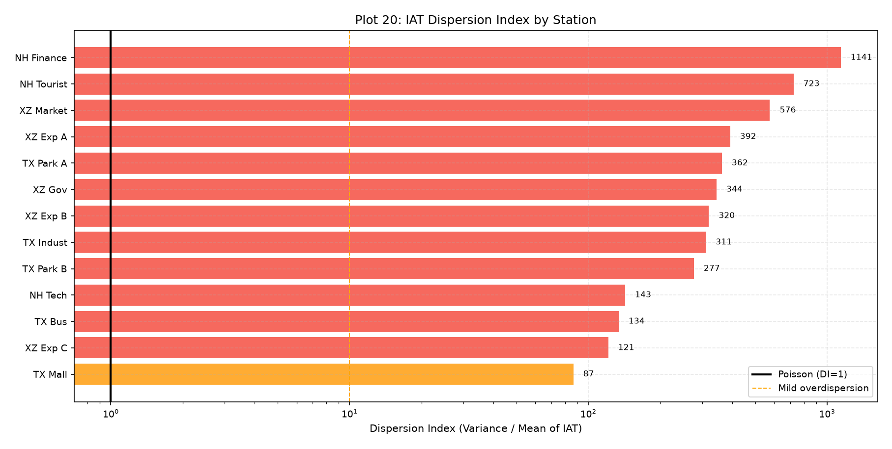
Dispersion Index range: 87 – 1141. All stations above DI=1: True. DI=1 means Poisson; DI>>1 means overdispersed (arrivals are burstier than Poisson). IMPORTANT CAVEAT: This is the *unconditional* dispersion index using all IATs. The Poisson hypothesis is about homogeneous intervals. After conditioning on hour-of-day (NHPP), the within-interval dispersion may be much lower. Week 3 must test Poisson *per hour-of-day stratum*, not on raw IATs. This plot sets the expectation: raw Poisson will almost certainly be rejected; the question is whether NHPP with hourly rates rescues it.
---
## Station Summary Table
| Station | Sessions | Arr/day | Fault% | Zero-E% | Flex% | Duration | Energy | DC% | IAT DI |
|---------|----------|---------|--------|---------|-------|----------|--------|-----|--------|
| TX Bus | 60,809 | 83 | 10.0% | 9.3% | 34.9% | 73m | 20.6kWh | 35% | 134 |
| TX Park B | 57,294 | 78 | 8.6% | 5.7% | 34.3% | 68m | 22.1kWh | 35% | 277 |
| TX Mall | 56,605 | 77 | 25.5% | 17.1% | 30.7% | 75m | 18.2kWh | 20% | 87 |
| XZ Exp C | 50,187 | 69 | 30.4% | 20.5% | 32.6% | 31m | 15.2kWh | 54% | 121 |
| XZ Gov | 36,551 | 50 | 12.3% | 8.6% | 36.7% | 79m | 23.0kWh | 42% | 344 |
| XZ Market | 34,491 | 47 | 26.5% | 19.9% | 41.9% | 83m | 16.5kWh | 26% | 576 |
| NH Tech | 28,867 | 39 | 9.7% | 4.3% | 37.0% | 58m | 19.8kWh | 44% | 143 |
| TX Park A | 27,845 | 38 | 20.3% | 6.4% | 43.0% | 44m | 12.6kWh | 28% | 362 |
| NH Tourist | 23,659 | 32 | 26.3% | 14.4% | 38.6% | 47m | 17.6kWh | 48% | 723 |
| NH Finance | 18,923 | 26 | 19.4% | 9.1% | 35.0% | 56m | 20.2kWh | 36% | 1141 |
| TX Indust | 18,370 | 25 | 7.9% | 7.2% | 28.4% | 72m | 18.1kWh | 36% | 311 |
| XZ Exp A | 15,075 | 21 | 32.4% | 25.5% | 33.7% | 32m | 16.0kWh | 59% | 392 |
| XZ Exp B | 12,401 | 17 | 23.1% | 19.2% | 38.3% | 34m | 16.9kWh | 60% | 320 |

## Key Findings for Downstream Modeling
1. **Poisson Validity (Week 3):** IAT dispersion indices are uniformly >>1 across all stations, confirming raw Poisson will be rejected. NHPP with hourly rate functions is the appropriate next step. Per-station testing is mandatory.

2. **NHPP Specification (Week 3):** Hourly profiles show strong time-of-day periodicity. Weekday/weekend separation is likely necessary. The TOU price overlay determines whether price should be a covariate in the rate function.

3. **ML Feature Design (Week 5):** Key features: hour_of_day, day_of_week, is_weekend, lag_1, lag_24, lag_168, rolling_7d_mean. Weather features should be included only if detrended analysis shows significant effects. Station-level features capture structural heterogeneity.

4. **Service Time for M/G/s (Week 4):** Distributions are right-skewed with CV > 1, confirming M/M/s (CV=1 assumption) will underestimate congestion. Separate fits needed for DC Fast and Level 2. Mixed category needs decision.

5. **Simulation Inputs (Week 6):** Per-station arrival rates (NHPP), per-charger-type service time distributions, per-station fault rates (not uniform 18.6%), and zero-energy session handling (short occupancy, no energy).

6. **Scheduling Potential (Week 7):** Bounded by the fraction of Flexible sessions occurring during Peak/Super-peak hours. TOU price ratio of 3.19x sets the maximum per-session savings. Actual savings depend on behavioral flexibility distribution.

## Sanity Checks
- [ ] Total sessions in all plots = 441,077
- [ ] Station counts sum correctly
- [ ] Fault rate in Plot 13 averages to ~18.6% when weighted by station size
- [ ] Zero-energy count matches Week 1 report (54,621)
- [ ] Hourly profile sums to ~603/day across all stations
- [ ] No plot shows data outside Jan 2020 – Dec 2021 range
- [ ] Service time plots exclude zero-energy sessions
- [ ] Weather detrended correlation is smaller than raw correlation

## Failure Modes to Watch
1. **Aggregation artifact in hourly profile:** Pooling across stations with different peak hours would flatten the overall profile. Check per-station profiles match.
2. **Survivor bias in service time:** If we only measure completed sessions, we miss sessions still in progress at data cutoff (right censoring).
3. **Weather confound:** Temperature correlation may entirely reflect seasonality. The detrended analysis is the valid test.
4. **CNY distortion:** If CNY periods aren't excluded from summary statistics, they pull down means and inflate variance.
5. **Charger type boundary:** The 22/30 kW cutoffs for DC/L2/Mixed are arbitrary. If the distribution is smooth across this boundary, the classification may be misleading.
